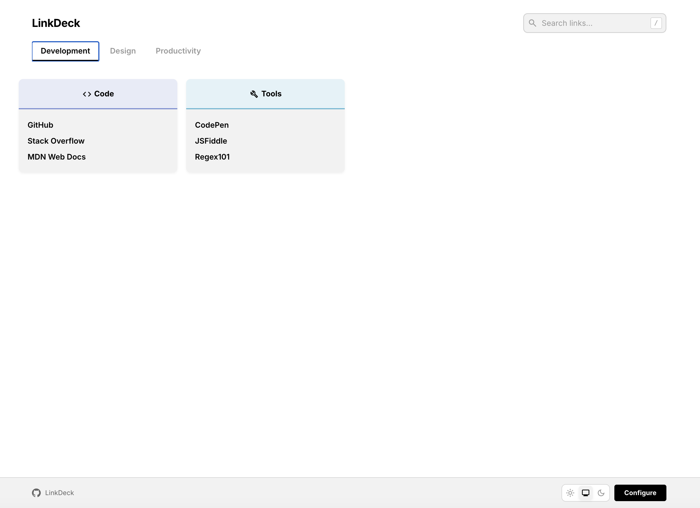
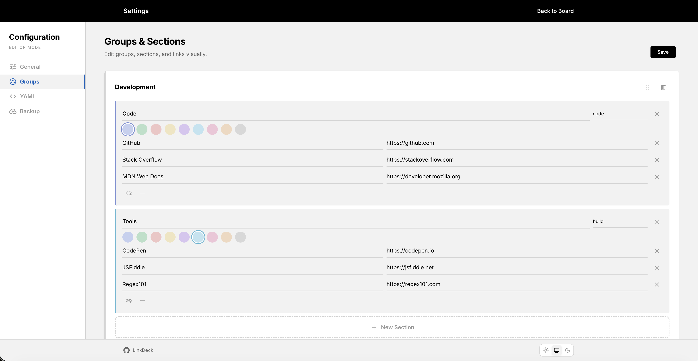
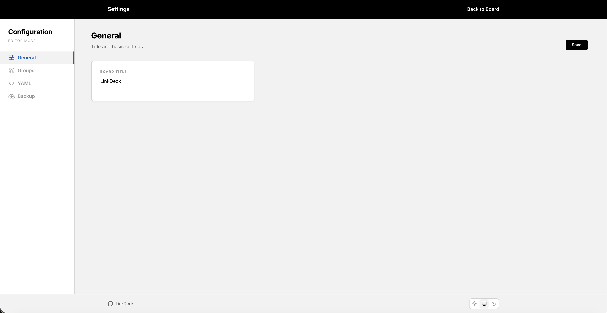
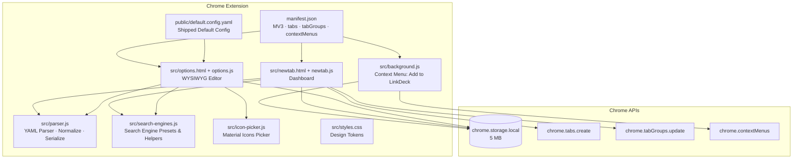
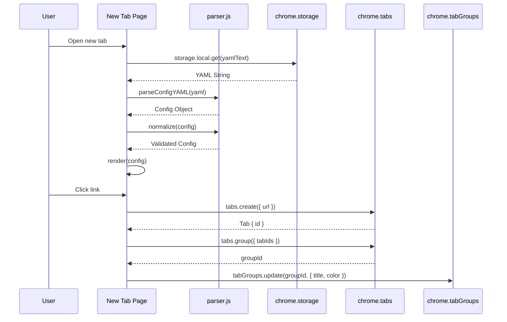
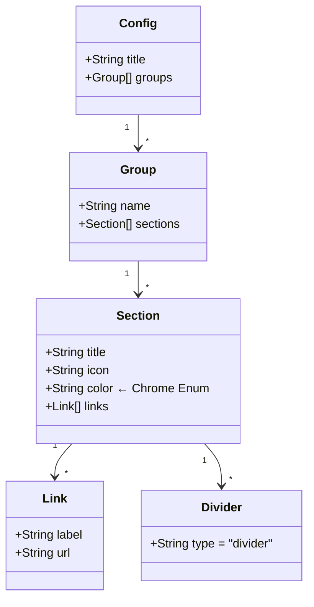

# LinkDeck

[](https://github.com/64x-lunicorn/LinkDeck/actions/workflows/ci.yml)
[](https://github.com/64x-lunicorn/LinkDeck/actions/workflows/codeql.yml)


Chrome Extension (Manifest V3) — a configurable new-tab dashboard with Chrome Tab Groups integration.

## Screenshots

| Dashboard | Groups Editor | General Settings |
|:-:|:-:|:-:|
|  |  |  |

## Features

- **Chrome Tab Groups** — Links open automatically in color-coded Chrome Tab Groups (one group per section)
- **Spotlight Search** — Unified search bar: filters dashboard links as you type, press Enter to search the web (Ecosia, DuckDuckGo, Google, Bing, or custom engine)
- **Search filter counter** — Shows "X of Y links" when filtering
- **Link tooltips** — Hover any link to see the full URL
- **WYSIWYG Editor** — Visually manage groups, sections, and links (options page)
- **Undo / Redo** — Ctrl+Z / Ctrl+Shift+Z in the WYSIWYG editor (up to 30 steps)
- **Icon Picker** — Visual Material Icons grid with search to choose section icons
- **Collapsible Editor** — Collapse/expand groups and sections for easier navigation
- **Context Menu** — Right-click any link or page → "Add to LinkDeck"
- **Drag & Drop** — Move sections between groups
- **9 Chrome Colors** — `grey`, `blue`, `red`, `yellow`, `green`, `pink`, `purple`, `cyan`, `orange`
- **YAML Config** — Plain-text configuration with live validation and fix hints
- **Backup & Restore** — Automatic backups, import/export as YAML file (with file validation)
- **Responsive** — Mobile, tablet, and desktop breakpoints

## Architecture



## Data Flow



## Config Schema



## YAML Example

```yaml
title: "LinkDeck"

groups:
  - name: "Development"
    sections:
      - title: "Code"
        icon: "code"
        color: blue
        links:
          - label: "GitHub"
            url: "https://github.com"
          - divider: true
          - label: "Stack Overflow"
            url: "https://stackoverflow.com"

  - name: "Design"
    sections:
      - title: "Inspiration"
        icon: "palette"
        color: purple
        links:
          - label: "Dribbble"
            url: "https://dribbble.com"
```

## Project Structure

```
LinkDeck/
├── src/
│   ├── newtab.html       # New tab page (dashboard)
│   ├── newtab.js         # Rendering, Tab Groups, search
│   ├── options.html      # Settings (4 views)
│   ├── options.js        # WYSIWYG editor, drag & drop, undo/redo
│   ├── parser.js         # YAML ↔ Config (parse, normalize, serialize)
│   ├── parser.test.js    # Vitest unit tests (61 tests)
│   ├── search-engines.js  # Web search engine presets & helpers
│   ├── search-engines.test.js # Engine tests (11 tests)
│   ├── icon-picker.js    # Material Icons picker component
│   ├── icon-picker.test.js # Icon picker tests (1 test)
│   ├── background.js     # Service worker (context menu)
│   ├── styles.css        # Design tokens & theme
│   └── theme.js          # Light / system / dark toggle
├── public/
│   ├── default.config.yaml   # Shipped default configuration
│   ├── manifest.json         # Chrome Extension Manifest V3
│   └── icons/
├── .github/
│   ├── copilot-instructions.md   # GitHub Copilot project context
│   ├── instructions/             # Scoped Copilot instructions per module
│   ├── dependabot.yml
│   └── workflows/                # CI, CodeQL, Release
├── .vscode/
│   ├── settings.json             # Editor & search settings
│   └── extensions.json           # Recommended extensions
├── images/                       # README screenshots
├── .editorconfig                 # Cross-editor formatting
├── .cursorrules                  # Cursor AI context
├── AGENTS.md                     # AI agent context (Codex, ChatGPT, etc.)
├── CLAUDE.md                     # Claude / Claude Code context
├── vite.config.js                # Build config (Vite)
├── eslint.config.js
├── package.json
├── CHANGELOG.md
├── CONTRIBUTING.md
└── LICENSE
```

## Setup

```bash
# Install dependencies
npm install

# Development server
npm run dev

# Production build
npm run build

# Run tests
npm test
```

## Load Chrome Extension

1. Run `npm run build`
2. Chrome → `chrome://extensions` → enable Developer mode
3. "Load unpacked" → select the `dist/` folder

## Permissions

| Permission      | Purpose                                       |
| --------------- | --------------------------------------------- |
| `storage`       | Persist config in `chrome.storage.local`      |
| `tabs`          | Create and group tabs                         |
| `tabGroups`     | Name and color tab groups                     |
| `contextMenus`  | "Add to LinkDeck" right-click menu item       |

## Tests

```bash
npm test            # Single run
npm run test:watch  # Watch mode
```

73 tests cover:
- `unquote()` — Quote removal
- `parseConfigYAML()` — Parsing all formats (groups, legacy sections, dividers, icons, colors)
- `normalize()` — Validation, Chrome color enum, legacy migration, error messages
- `configToYAML()` — Serialization
- **Roundtrip** — Parse → Serialize → Parse consistency
- `SEARCH_ENGINES` — Presets validation, URL building, encoding
- `createIconPicker` — Module export check

## Roadmap

Planned features for future releases:

| # | Feature | Description |
|---|---------|-------------|
| 1 | **Bookmarks Import** | Import Chrome bookmarks directly into LinkDeck groups |
| 2 | **Frequently Used Links** | Track click counts, surface most-used links |
| 3 | **Widgets** | Optional dashboard widgets (clock, weather, notes) |
| 4 | **Cross-Device Sync** | Sync config via Google Drive or ChromeSync |
| 5 | **Custom Themes** | User-defined color schemes, fonts, and background images |

## AI-Ready

This repository is configured for AI-assisted development with multiple coding agents:

| File / Directory | Agent |
|-----------------|-------|
| `.github/copilot-instructions.md` | GitHub Copilot |
| `.github/instructions/*.instructions.md` | GitHub Copilot (scoped per module) |
| `AGENTS.md` | OpenAI Codex, ChatGPT |
| `CLAUDE.md` | Claude, Claude Code |
| `.cursorrules` | Cursor |
| `.editorconfig` | All editors |
| `.vscode/settings.json` | VS Code |
| `.vscode/extensions.json` | VS Code (recommended extensions) |

## License

GPLv3 — see [LICENSE](LICENSE).
