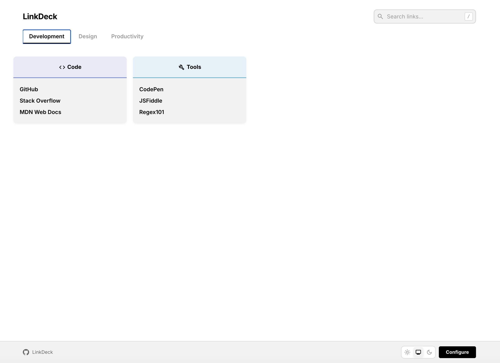
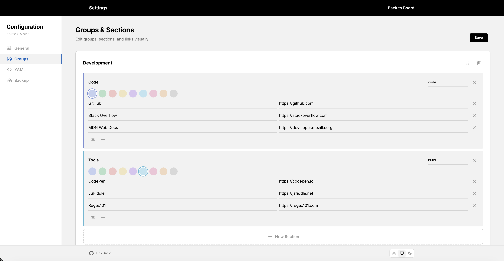
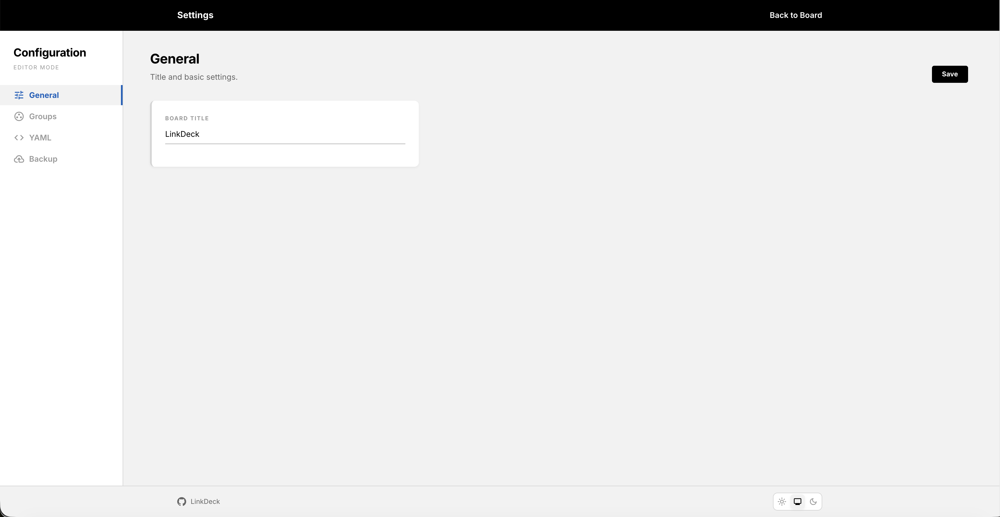
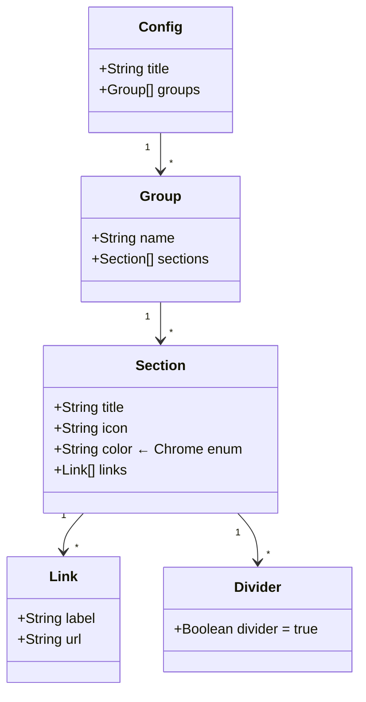
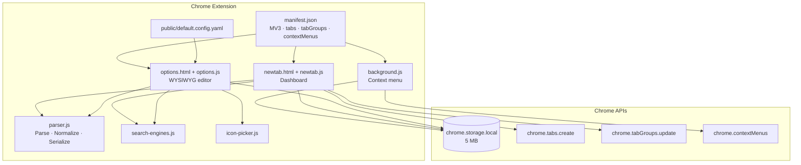
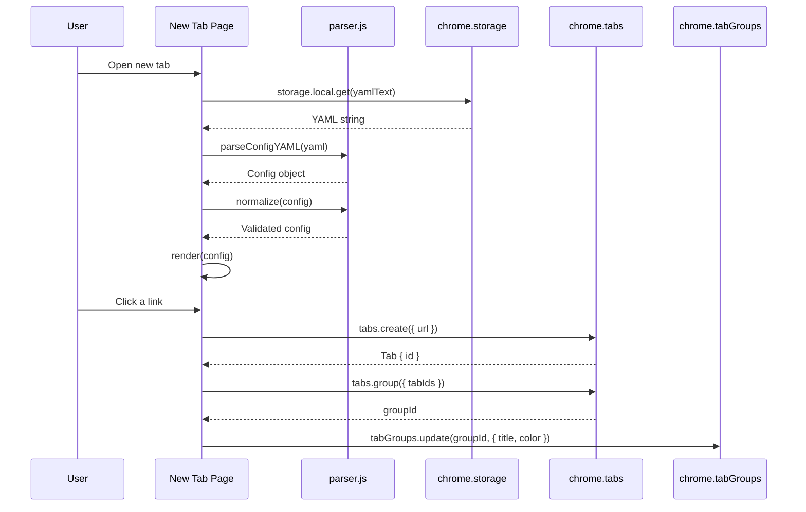

<div align="center">


# LinkDeck

### Your new tab, finally worth opening.

A **Chrome new-tab dashboard** that turns a plain-text YAML file into a fast, colour-coded link board — and files every link you open into a native **Chrome Tab Group**, automatically.

[](https://github.com/64x-lunicorn/LinkDeck/actions/workflows/ci.yml)
[](https://github.com/64x-lunicorn/LinkDeck/actions/workflows/codeql.yml)
[](CHANGELOG.md)
[](#-testing)
[](public/manifest.json)
[](package.json)
[](LICENSE)

[**Quick Start**](#-quick-start) · [**Features**](#-features) · [**Config**](#-configuration) · [**Shortcuts**](#-keyboard-shortcuts) · [**Architecture**](#-architecture) · [**Contributing**](CONTRIBUTING.md)

<br />



</div>

---

## Why LinkDeck?

Bookmark bars run out of room. Start-page services want an account. Most new-tab extensions want your data.

LinkDeck is the boring, private alternative: **one YAML file, stored locally, rendered fast.** Edit it in a visual editor or as raw text — your call. Nothing leaves your browser, there is no backend, and the whole thing ships with **zero runtime dependencies**.

The killer feature: every link you click lands in a **Chrome Tab Group named after its section**, in that section's colour — reusing the group if it already exists. Open five links from *Deploy Checklist* and you get one tidy, colour-matched group, not five loose tabs.

---

## ⚡ Quick Start

```bash
git clone https://github.com/64x-lunicorn/LinkDeck.git
cd LinkDeck
npm install
npm run build
```

Then load it into Chrome:

1. Open `chrome://extensions`
2. Toggle **Developer mode** (top right)
3. Click **Load unpacked** → select the `dist/` folder
4. Open a new tab 🎉

> **Prefer a release build?** Every tagged release ships a ready-to-load `linkdeck-vX.Y.Z.zip` on the [Releases page](https://github.com/64x-lunicorn/LinkDeck/releases).

---

## ✨ Features

|  | Feature | What it does |
|:-:|---|---|
| 🗂️ | **Chrome Tab Groups** | Every link opens into a native tab group named & coloured after its section |
| 🔍 | **Spotlight Search** | One bar: filters your links as you type, `Enter` searches the web |
| 🎨 | **WYSIWYG Editor** | Drag & drop groups, sections and links — no YAML required |
| 📝 | **YAML Editor** | Or skip the UI entirely: live validation with actionable fix hints |
| ↩️ | **Undo / Redo** | Snapshot-based history, up to 30 steps, `⌘Z` / `⌘⇧Z` |
| 🖼️ | **Icon Picker** | 4 176 Material Symbols across 17 category tabs, searchable |
| 🌗 | **Light / Dark / System** | Fully tokenised CSS theme, respects your OS setting |
| 🖱️ | **Context Menu** | Right-click any page or link → *Add to LinkDeck* |
| 💾 | **Backup & Restore** | 10 rolling auto-snapshots, plus YAML import/export |
| 🔒 | **Local only** | `chrome.storage.local` — no account, no sync, no telemetry |
| 📱 | **Responsive** | Mobile, tablet and desktop breakpoints |
| 🪶 | **Vanilla JS** | No framework, no bundle bloat, ES modules end to end |

### Screenshots

| Dashboard | Groups Editor | Settings |
|:-:|:-:|:-:|
|  |  |  |

---

## 🎛️ Configuration

Everything is one YAML document. Groups become tabs, sections become cards, links become links.

```yaml
title: "LinkDeck"

groups:
  - name: "Development"
    sections:
      - title: "Code"
        icon: "code"        # any Material Symbols name
        color: blue         # Chrome Tab Group colour
        links:
          - label: "GitHub"
            url: "https://github.com"
          - divider: true   # visual separator
          - label: "MDN Web Docs"
            url: "https://developer.mozilla.org"

  - name: "Design"
    sections:
      - title: "Inspiration"
        icon: "palette"
        color: purple
        links:
          - label: "Dribbble"
            url: "https://dribbble.com"
```

**Colours** map 1:1 to Chrome's own tab-group palette:

`grey` · `blue` · `red` · `yellow` · `green` · `pink` · `purple` · `cyan` · `orange`

<details>
<summary><b>Full schema reference</b></summary>


```mermaid
classDiagram
    class Config {
        +String title
        +Group[] groups
    }
    class Group {
        +String name
        +Section[] sections
    }
    class Section {
        +String title
        +String icon
        +String color  ← Chrome enum
        +Link[] links
    }
    class Link {
        +String label
        +String url
    }
    class Divider {
        +Boolean divider = true
    }

    Config "1" --> "*" Group
    Group "1" --> "*" Section
    Section "1" --> "*" Link
    Section "1" --> "*" Divider
```

| Field | Level | Required | Notes |
|---|---|:-:|---|
| `title` | root | – | Board heading, defaults to `LinkDeck` |
| `groups[].name` | group | ✅ | Becomes a tab in the dashboard |
| `sections[].title` | section | ✅ | Card heading & tab-group name |
| `sections[].icon` | section | – | Material Symbols (Outlined) icon name |
| `sections[].color` | section | – | One of the nine Chrome colours, defaults to `grey` |
| `links[].label` | link | ✅ | Display text |
| `links[].url` | link | ✅ | Full URL including scheme |
| `links[].divider` | link | – | `true` renders a separator instead of a link |

Legacy configs using a top-level `sections:` list are migrated to groups automatically.

</details>

<details>
<summary><b>Storage keys</b></summary>

| Key | Type | Purpose |
|---|---|---|
| `yamlText` | `string` | The full YAML config |
| `searchEngine` | `{ id, name, urlTemplate }` | Selected or custom web search engine |
| `searchBarVisible` | `boolean` | Show/hide the Spotlight bar |
| `yamlBackups` | `array` | Up to 10 rolling snapshots |

All of it lives in `chrome.storage.local` (5 MB) — never `chrome.storage.sync` (8 KB per item).

</details>

---

## ⌨️ Keyboard Shortcuts

| Context | Keys | Action |
|---|---|---|
| Dashboard | <kbd>/</kbd> | Focus Spotlight search |
| Dashboard | <kbd>Enter</kbd> | Search the web with your chosen engine |
| Dashboard | <kbd>Esc</kbd> | Clear & blur the search bar |
| Editor | <kbd>⌘</kbd>/<kbd>Ctrl</kbd> + <kbd>Z</kbd> | Undo |
| Editor | <kbd>⌘</kbd>/<kbd>Ctrl</kbd> + <kbd>⇧</kbd> + <kbd>Z</kbd> | Redo |

**Search engines:** Ecosia (default), DuckDuckGo, Google, Bing — or bring your own via a `{query}` URL template.

---

## 🏗️ Architecture

Six small ES modules, no framework, no build-time magic beyond Vite bundling.

```
src/
├── newtab.js         # Dashboard render, Tab Groups, Spotlight
├── options.js        # WYSIWYG + YAML editor, undo/redo, backups
├── parser.js         # Hand-written YAML parser · normalize · serialize
├── search-engines.js # Engine presets & storage helpers
├── icon-picker.js    # Material Icons grid (4 176 icons, 17 tabs)
├── icon-data.js      # AUTO-GENERATED — never edit by hand
├── background.js     # Service worker: "Add to LinkDeck" context menu
├── theme.js          # Light / system / dark
└── styles.css        # Design tokens & responsive layout
```

<details>
<summary><b>Module graph</b></summary>


```mermaid
graph TD
    subgraph "Chrome Extension"
        M[manifest.json<br/>MV3 · tabs · tabGroups · contextMenus]
        BG[background.js<br/>Context menu]
        NT[newtab.html + newtab.js<br/>Dashboard]
        OPT[options.html + options.js<br/>WYSIWYG editor]
        P[parser.js<br/>Parse · Normalize · Serialize]
        SE[search-engines.js]
        IP[icon-picker.js]
        CFG[public/default.config.yaml]
    end

    subgraph "Chrome APIs"
        STORE[(chrome.storage.local<br/>5 MB)]
        TABS[chrome.tabs.create]
        TG[chrome.tabGroups.update]
        CM[chrome.contextMenus]
    end

    NT --> P
    NT --> SE
    OPT --> P
    OPT --> SE
    OPT --> IP
    BG --> STORE
    BG --> CM
    NT --> STORE
    OPT --> STORE
    NT --> TABS
    NT --> TG
    M --> NT
    M --> OPT
    M --> BG
    CFG --> OPT
```

</details>

<details>
<summary><b>What happens when you click a link</b></summary>


```mermaid
sequenceDiagram
    participant U as User
    participant NTP as New Tab Page
    participant P as parser.js
    participant CS as chrome.storage
    participant CT as chrome.tabs
    participant CTG as chrome.tabGroups

    U->>NTP: Open new tab
    NTP->>CS: storage.local.get(yamlText)
    CS-->>NTP: YAML string
    NTP->>P: parseConfigYAML(yaml)
    P-->>NTP: Config object
    NTP->>P: normalize(config)
    P-->>NTP: Validated config
    NTP->>NTP: render(config)

    U->>NTP: Click a link
    NTP->>CT: tabs.create({ url })
    CT-->>NTP: Tab { id }
    NTP->>CT: tabs.group({ tabIds })
    CT-->>NTP: groupId
    NTP->>CTG: tabGroups.update(groupId, { title, color })
```

</details>

### Permissions — and why

| Permission | Why it is needed |
|---|---|
| `storage` | Persist your config locally |
| `tabs` | Open links and group them |
| `tabGroups` | Give each group its name and colour |
| `contextMenus` | The "Add to LinkDeck" right-click item |

No host permissions. No network requests other than Google Fonts for the icon set.

---

## 🛠️ Development

```bash
npm install          # install dev dependencies
npm run dev          # Vite dev server
npm run lint         # ESLint
npm test             # Vitest — 73 tests
npm run test:watch   # Vitest in watch mode
npm run build        # production build → dist/

npm run lint && npm test && npm run build   # full validation
```

### 🧪 Testing

73 tests run in Node (no browser, no jsdom) and live next to their source files:

| Suite | Tests | Covers |
|---|:-:|---|
| `parser.test.js` | 61 | `unquote`, `parseConfigYAML`, `normalize`, `configToYAML`, roundtrip |
| `search-engines.test.js` | 11 | Presets, URL building, query encoding |
| `icon-picker.test.js` | 1 | Module export contract |

### House rules

These are deliberate and non-negotiable — see [`CONTRIBUTING.md`](CONTRIBUTING.md):

1. **Vanilla JS only.** No React, Vue, Angular, or any framework.
2. **Hand-written YAML parser.** No `js-yaml` or similar.
3. **`chrome.storage.local` only.** Never `chrome.storage.sync`.
4. **Design tokens for all colours.** No hardcoded hex in CSS.
5. **`icon-data.js` is generated.** Never edit it by hand.
6. Guard Chrome and DOM APIs — tests run in Node, where neither exists.

---

## 🗺️ Roadmap

- [ ] **Bookmarks import** — pull Chrome bookmarks straight into groups
- [ ] **Frequently used** — track clicks, surface your top links
- [ ] **Widgets** — optional clock, weather and notes tiles
- [ ] **Cross-device sync** — opt-in, via Google Drive
- [ ] **Custom themes** — user-defined palettes, fonts and backgrounds

Got an idea? [Open an issue](https://github.com/64x-lunicorn/LinkDeck/issues) — feature requests are welcome.

---

## 🤖 AI-Ready

This repo carries context files for every major coding agent, so an assistant picks up the house rules without being told twice.

| File | Agent |
|---|---|
| `CLAUDE.md` | Claude, Claude Code |
| `AGENTS.md` | OpenAI Codex, ChatGPT |
| `.github/copilot-instructions.md` | GitHub Copilot |
| `.github/instructions/*.instructions.md` | GitHub Copilot (per-module scope) |
| `.cursorrules` | Cursor |
| `.editorconfig` · `.vscode/` | All editors / VS Code |

---

## 🤝 Contributing

PRs welcome. Read [`CONTRIBUTING.md`](CONTRIBUTING.md), keep `npm run lint && npm test && npm run build` green, and note the house rules above.

## 📄 License

[GPL-3.0-or-later](LICENSE) © [64x-lunicorn](https://github.com/64x-lunicorn)

<div align="center">
<br />
<sub>Built with vanilla JavaScript, a hand-written YAML parser, and a mild dislike of bookmark bars.</sub>
</div>
