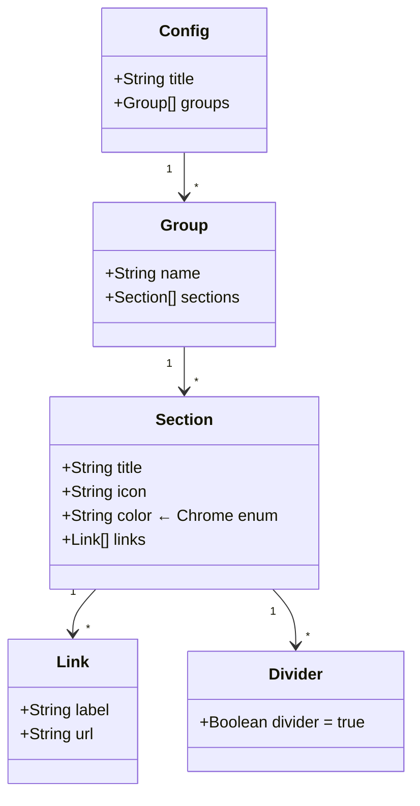
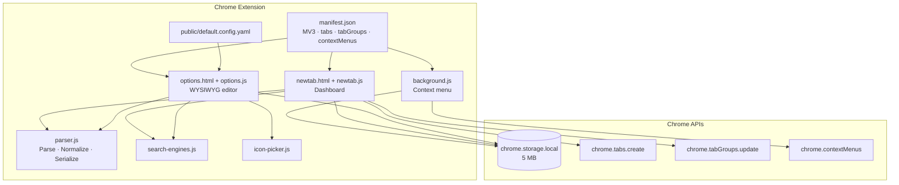
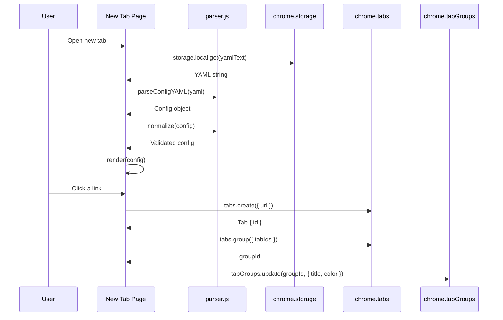

<div align="center">

# LinkDeck


### Your new tab, finally worth opening.

A **Chrome new-tab dashboard** that turns a plain-text YAML file into a fast, colour-coded link board — and files every link you open into a native **Chrome Tab Group**, automatically.

[](LICENSE)
[](package.json)
[](https://github.com/64x-lunicorn/LinkDeck/actions/workflows/ci.yml)
[](https://github.com/64x-lunicorn/LinkDeck/actions/workflows/codeql.yml)

[Quickstart](#quickstart) &nbsp; / &nbsp;
[How it works](#how-it-works) &nbsp; / &nbsp;
[Documentation](#documentation) &nbsp; / &nbsp;
[Contributing](CONTRIBUTING.md) &nbsp; / &nbsp;
[Report a bug](https://github.com/64x-lunicorn/LinkDeck/issues)

</div>

---

## Why LinkDeck?

Bookmark bars run out of room. Start-page services want an account. Most new-tab extensions want your data.

**one YAML file, stored locally, rendered fast**

| | What you get |
| :--- | :--- |
| **Chrome Tab Groups** | Every link opens into a native tab group, named and coloured after its section — reusing the group if it already exists. |
| **Spotlight search** | One bar filters your links as you type; `Enter` searches the web with your chosen engine. |
| **WYSIWYG or raw YAML** | Drag-and-drop groups, sections and links, or skip the UI and edit YAML directly with live validation. |
| **Local only** | Everything lives in `chrome.storage.local` — no account, no sync, no telemetry. |
| **Backup & restore** | 10 rolling auto-snapshots, plus YAML import/export. |
| **Icon picker** | 4,176 Material Symbols across 17 category tabs, searchable. |

## How it works

```text
new tab ──▶ newtab.js ──▶ parser.js ──▶ render groups / sections / links
                │
                └─ click a link ──▶ chrome.tabs.create ──▶ chrome.tabGroups.update
                                     (grouped by section name + colour)
```

Groups become tabs, sections become colour-coded cards, and links become native Chrome Tab Groups the moment you click them.

## Quickstart

1. Clone the repository

   ```bash
   git clone https://github.com/64x-lunicorn/LinkDeck.git
   ```

2. Enter the directory

   ```bash
   cd LinkDeck
   ```

3. Install dependencies

   ```bash
   npm install
   ```

4. Build the extension

   ```bash
   npm run build
   ```

5. Open `chrome://extensions`, enable **Developer mode**, click **Load unpacked**, and select the `dist/` folder.

> **Prefer a release build?** Every tagged release ships a ready-to-load `linkdeck-vX.Y.Z.zip` on the [Releases page](https://github.com/64x-lunicorn/LinkDeck/releases).

## Configuration

Everything is one YAML document. Groups become tabs, sections become cards, links become links.

```yaml
title: "LinkDeck"

groups:
  - name: "Development"
    sections:
      - title: "Code"
        icon: "code"        # any Material Symbols name
        color: blue         # Chrome Tab Group colour
        links:
          - label: "GitHub"
            url: "https://github.com"
          - divider: true   # visual separator
          - label: "MDN Web Docs"
            url: "https://developer.mozilla.org"

  - name: "Design"
    sections:
      - title: "Inspiration"
        icon: "palette"
        color: purple
        links:
          - label: "Dribbble"
            url: "https://dribbble.com"
```

**Colours** map 1:1 to Chrome's own tab-group palette:

`grey` · `blue` · `red` · `yellow` · `green` · `pink` · `purple` · `cyan` · `orange`

### Full schema reference


```mermaid
classDiagram
    class Config {
        +String title
        +Group[] groups
    }
    class Group {
        +String name
        +Section[] sections
    }
    class Section {
        +String title
        +String icon
        +String color  ← Chrome enum
        +Link[] links
    }
    class Link {
        +String label
        +String url
    }
    class Divider {
        +Boolean divider = true
    }

    Config "1" --> "*" Group
    Group "1" --> "*" Section
    Section "1" --> "*" Link
    Section "1" --> "*" Divider
```

| Field | Level | Required | Notes |
|---|---|:-:|---|
| `title` | root | – | Board heading, defaults to `LinkDeck` |
| `groups[].name` | group | ✅ | Becomes a tab in the dashboard |
| `sections[].title` | section | ✅ | Card heading & tab-group name |
| `sections[].icon` | section | – | Material Symbols (Outlined) icon name |
| `sections[].color` | section | – | One of the nine Chrome colours, defaults to `grey` |
| `links[].label` | link | ✅ | Display text |
| `links[].url` | link | ✅ | Full URL including scheme |
| `links[].divider` | link | – | `true` renders a separator instead of a link |

Legacy configs using a top-level `sections:` list are migrated to groups automatically.

### Storage keys

| Key | Type | Purpose |
|---|---|---|
| `yamlText` | `string` | The full YAML config |
| `searchEngine` | `{ id, name, urlTemplate }` | Selected or custom web search engine |
| `searchBarVisible` | `boolean` | Show/hide the Spotlight bar |
| `yamlBackups` | `array` | Up to 10 rolling snapshots |

All of it lives in `chrome.storage.local` (5 MB) — never `chrome.storage.sync` (8 KB per item).

### Screenshots

| Dashboard | Groups Editor | Settings |
|:-:|:-:|:-:|
|  |  |  |

## Keyboard shortcuts

| Context | Keys | Action |
|---|---|---|
| Dashboard | `/` | Focus Spotlight search |
| Dashboard | `Enter` | Search the web with your chosen engine |
| Dashboard | `Esc` | Clear & blur the search bar |
| Editor | `Cmd`/`Ctrl` + `Z` | Undo |
| Editor | `Cmd`/`Ctrl` + `Shift` + `Z` | Redo |

**Search engines:** Ecosia (default), DuckDuckGo, Google, Bing — or bring your own via a `{query}` URL template.

## Architecture

Six small ES modules, no framework, no build-time magic beyond Vite bundling.

```
src/
├── newtab.js         # Dashboard render, Tab Groups, Spotlight
├── options.js        # WYSIWYG + YAML editor, undo/redo, backups
├── parser.js         # Hand-written YAML parser · normalize · serialize
├── search-engines.js # Engine presets & storage helpers
├── icon-picker.js    # Material Icons grid (4 176 icons, 17 tabs)
├── icon-data.js      # AUTO-GENERATED — never edit by hand
├── background.js     # Service worker: "Add to LinkDeck" context menu
├── theme.js          # Light / system / dark
└── styles.css        # Design tokens & responsive layout
```

### Module graph


```mermaid
graph TD
    subgraph "Chrome Extension"
        M[manifest.json<br/>MV3 · tabs · tabGroups · contextMenus]
        BG[background.js<br/>Context menu]
        NT[newtab.html + newtab.js<br/>Dashboard]
        OPT[options.html + options.js<br/>WYSIWYG editor]
        P[parser.js<br/>Parse · Normalize · Serialize]
        SE[search-engines.js]
        IP[icon-picker.js]
        CFG[public/default.config.yaml]
    end

    subgraph "Chrome APIs"
        STORE[(chrome.storage.local<br/>5 MB)]
        TABS[chrome.tabs.create]
        TG[chrome.tabGroups.update]
        CM[chrome.contextMenus]
    end

    NT --> P
    NT --> SE
    OPT --> P
    OPT --> SE
    OPT --> IP
    BG --> STORE
    BG --> CM
    NT --> STORE
    OPT --> STORE
    NT --> TABS
    NT --> TG
    M --> NT
    M --> OPT
    M --> BG
    CFG --> OPT
```

### What happens when you click a link


```mermaid
sequenceDiagram
    participant U as User
    participant NTP as New Tab Page
    participant P as parser.js
    participant CS as chrome.storage
    participant CT as chrome.tabs
    participant CTG as chrome.tabGroups

    U->>NTP: Open new tab
    NTP->>CS: storage.local.get(yamlText)
    CS-->>NTP: YAML string
    NTP->>P: parseConfigYAML(yaml)
    P-->>NTP: Config object
    NTP->>P: normalize(config)
    P-->>NTP: Validated config
    NTP->>NTP: render(config)

    U->>NTP: Click a link
    NTP->>CT: tabs.create({ url })
    CT-->>NTP: Tab { id }
    NTP->>CT: tabs.group({ tabIds })
    CT-->>NTP: groupId
    NTP->>CTG: tabGroups.update(groupId, { title, color })
```

### Permissions — and why

| Permission | Why it is needed |
|---|---|
| `storage` | Persist your config locally |
| `tabs` | Open links and group them |
| `tabGroups` | Give each group its name and colour |
| `contextMenus` | The "Add to LinkDeck" right-click item |

No host permissions. No network requests other than Google Fonts for the icon set.

## Roadmap

- [ ] **Bookmarks import** — pull Chrome bookmarks straight into groups
- [ ] **Frequently used** — track clicks, surface your top links
- [ ] **Widgets** — optional clock, weather and notes tiles
- [ ] **Cross-device sync** — opt-in, via Google Drive
- [ ] **Custom themes** — user-defined palettes, fonts and backgrounds

Got an idea? [Open an issue](https://github.com/64x-lunicorn/LinkDeck/issues) — feature requests are welcome.

## AI-ready

This repo carries context files for every major coding agent, so an assistant picks up the house rules without being told twice.

| File | Agent |
|---|---|
| `CLAUDE.md` | Claude, Claude Code |
| `AGENTS.md` | OpenAI Codex, ChatGPT |
| `.github/copilot-instructions.md` | GitHub Copilot |
| `.github/instructions/*.instructions.md` | GitHub Copilot (per-module scope) |
| `.cursorrules` | Cursor |
| `.editorconfig` · `.vscode/` | All editors / VS Code |

## Documentation

| Guide | Start here when you want to... |
| :--- | :--- |
| [CI/CD](docs/ci-cd.md) | Understand the gate, run it locally and see the rules on `main`. |
| [Contributing](CONTRIBUTING.md) | Set up development, run the checks and submit a focused change. |
| [Security policy](SECURITY.md) | Report a vulnerability privately. |

## Contributing

Bug reports and focused pull requests are welcome. Run the whole gate locally before pushing:

```bash
npm run ci
```

Use synthetic data in examples, tests and issues. See [CONTRIBUTING.md](CONTRIBUTING.md) for the checks and what a change needs.

## License and credits

LinkDeck is licensed under the **[GNU General Public License v3.0](LICENSE)**.
The copyright notice is **Copyright (c) 2026 64x-lunicorn**.
